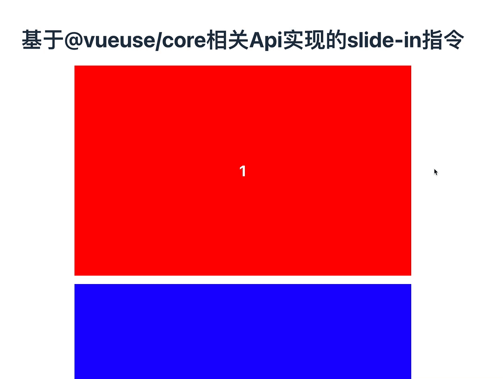

# 基于@vueuse/core相关Api实现的slide-in指令

> 页面向下滚动时，页面中某个元素实现渐渐划入的动画效果

## 核心代码如下：

```javascript
import { App, Directive } from 'vue'
import { useAnimate, useIntersectionObserver } from '@vueuse/core'

const keyframes = [
  { transform: 'translateY(80px) scale(0.9)', opacity: 0 },
  { transform: 'translateY(0) scale(1)', opacity: 1 },
]
const slideIn: Directive = {
  mounted(el, binding) {
    let lastY = 0
    useIntersectionObserver(el, ([{ isIntersecting, target, boundingClientRect }]) => {
      // scroll down ?
      const isBottom = lastY > boundingClientRect.y
      lastY = boundingClientRect.y
      if(!isBottom) return
      if(isIntersecting && target == el) {
        useAnimate(el, keyframes, {
          duration: 300,
          easing: 'ease-in',
          ...(binding.value || {})
        })
      }
    })
  }
}

export default {
  install: function(app: App) {
    app.directive('slide-in', slideIn)
  }
}
```

## 使用方式

### 程序入口处注册

```javascript
// ...
import slideIn from './v-slide-in'
const app = createApp(App)
app.use(slideIn)
// ...
```

### 页面中在元素上绑定指令即可

```vue
<template>
  <div v-for="index in 10" v-slide-in class="color-block">{{ index }}</div>
</template>
```

## 效果展示

